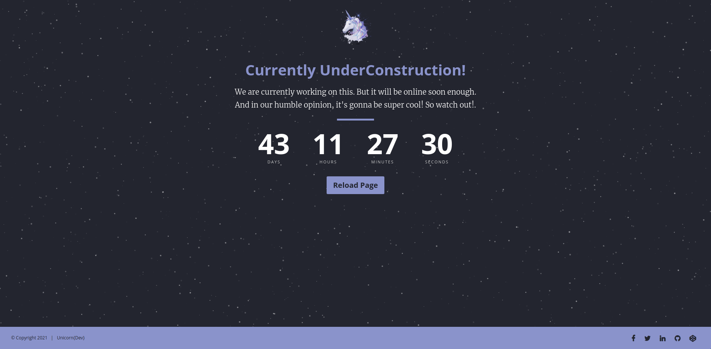

# Coming Soon Page For Underconstruction

It is based on the [Advent](https://www.styleshout.com/free-templates/advent/) HTML5/CSS3 template made by [Styleshout](https://www.styleshout.com). It also uses the following JavaScript libraries:
- [The Final Countdown](http://hilios.github.io/jQuery.countdown/)
- [particles.js](http://vincentgarreau.com/particles.js/)

### Features
- Modern & elegant design
- Responsive Design
- Animated background
- Multi-browser support
- Easy to setup
- The CSS framework is [Twitter Bootstrap](https://www.getbootstrap.com)
- Icons are [Font Awesome](https://www.fontawesome.io)
- All the third-party resources are hosted on a CDN 

### Setup
**1.** Change the logo

**2.** Add text content:
- Announcement
- Modal 

**3.** Change the date in the countdown timer

**4.** Customize the animated background. Refer to documentation: [Usage of particles.js](https://github.com/VincentGarreau/particles.js/#usage)

**5.** Styling the page by changing the values in [CSS file](css/style.css) - **styles.css**

**6.** Customize the social media links in the footer.

### Credits
- [Styleshout](https://www.styleshout.com)
- [Vincent Garreau](https://www.vincentgarreau.com)
- [Edson Hilios](http://edson.hilios.com.br)
